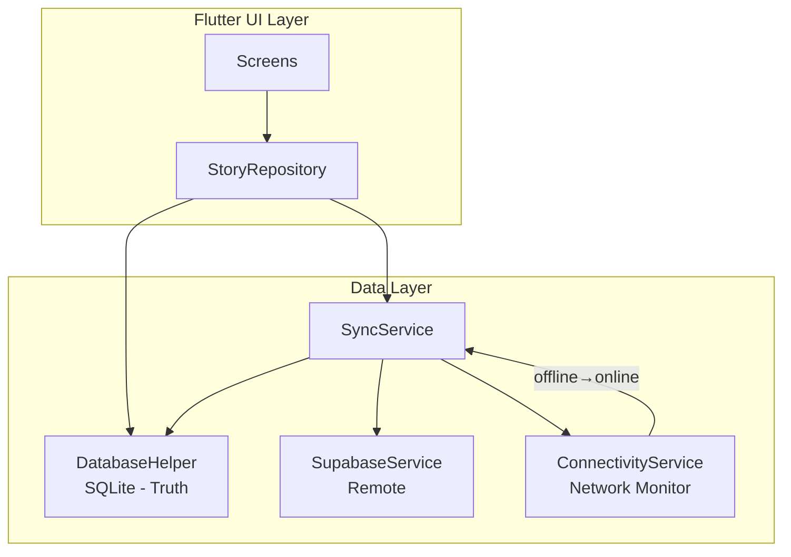

# Strict Offline-First Architecture — Walkthrough

## Summary

Transformed the booksapp from a **UI-only mockup** into a fully functional **Offline-First Architecture** with SQLite as absolute truth and Supabase sync support.

---

## Architecture Diagram

## New Files Created (8 files)

| File | Purpose |
|------|---------|
| [supabase_config.dart](file:///d:/ppflutter/storybook/booksapp/lib/config/supabase_config.dart) | Placeholder Supabase URL + anon key |
| [profile.dart](file:///d:/ppflutter/storybook/booksapp/lib/models/profile.dart) | Profile model with SQLite/Supabase serialization |
| [favorite.dart](file:///d:/ppflutter/storybook/booksapp/lib/models/favorite.dart) | Favorite junction model (replaces `isFavorite` boolean) |
| [database_helper.dart](file:///d:/ppflutter/storybook/booksapp/lib/services/database_helper.dart) | SQLite singleton — 5 tables, full CRUD, sync helpers, seed logic |
| [supabase_service.dart](file:///d:/ppflutter/storybook/booksapp/lib/services/supabase_service.dart) | Auth wrapper + raw table upsert/fetch |
| [connectivity_service.dart](file:///d:/ppflutter/storybook/booksapp/lib/services/connectivity_service.dart) | Network state monitor, fires reconnect callbacks |
| [sync_service.dart](file:///d:/ppflutter/storybook/booksapp/lib/services/sync_service.dart) | Push-then-pull sync engine with locked FIFO queue |
| [story_repository.dart](file:///d:/ppflutter/storybook/booksapp/lib/repositories/story_repository.dart) | Single data interface for all UI screens |

## Modified Files (12 files)

| File | Key Changes |
|------|-------------|
| [pubspec.yaml](file:///d:/ppflutter/storybook/booksapp/pubspec.yaml) | Added sqflite, supabase_flutter, uuid, connectivity_plus, path |
| [story.dart](file:///d:/ppflutter/storybook/booksapp/lib/models/story.dart) | Full schema alignment — userId, description, genre, status, timestamps, soft delete, toMap/fromMap/toSupabaseMap |
| [main.dart](file:///d:/ppflutter/storybook/booksapp/lib/main.dart) | Initializes Supabase, SQLite, ConnectivityService, SyncService, seeds data |
| [login_screen.dart](file:///d:/ppflutter/storybook/booksapp/lib/screens/login_screen.dart) | Real Supabase auth + "Continue Offline" option |
| [signup_screen.dart](file:///d:/ppflutter/storybook/booksapp/lib/screens/signup_screen.dart) | Real Supabase signup + local profile creation |
| [home_screen.dart](file:///d:/ppflutter/storybook/booksapp/lib/screens/home_screen.dart) | Reads from StoryRepository, shows sync indicators |
| [my_stories_screen.dart](file:///d:/ppflutter/storybook/booksapp/lib/screens/my_stories_screen.dart) | Reads from StoryRepository, search via SQLite |
| [favorites_screen.dart](file:///d:/ppflutter/storybook/booksapp/lib/screens/favorites_screen.dart) | Reads from favorites junction table, inline unfavorite |
| [story_details_screen.dart](file:///d:/ppflutter/storybook/booksapp/lib/screens/story_details_screen.dart) | Toggle favorite, soft delete, offline badge |
| [story_creation_screen.dart](file:///d:/ppflutter/storybook/booksapp/lib/screens/story_creation_screen.dart) | Creates real SQLite records, debounced saves |
| [story_editor_screen.dart](file:///d:/ppflutter/storybook/booksapp/lib/screens/story_editor_screen.dart) | Loads/saves via repository, debounced content updates |
| [reading_mode_screen.dart](file:///d:/ppflutter/storybook/booksapp/lib/screens/reading_mode_screen.dart) | Loads pages from SQLite |
| [profile_screen.dart](file:///d:/ppflutter/storybook/booksapp/lib/screens/profile_screen.dart) | Live stats from SQLite, sync trigger button |

## Offline-First Rules Enforced

| Rule | Implementation |
|------|----------------|
| **SQLite = Truth** | All UI reads come from local DB. Supabase is never queried for display. |
| **Sequential Sync Queue** | `sync_queue` table with autoincrement ID. Dequeued FIFO, one at a time. |
| **Push-then-Pull** | `syncAll()` calls `_pushLocalChanges()` before `_pullRemoteChanges()`. |
| **Soft Deletes** | `deleted_at` column on stories, story_pages, favorites. UI filters `WHERE deleted_at IS NULL`. |
| **Conditional Pull** | Only overwrite local row if `is_synced=1 AND is_dirty=0`. Dirty local data is never clobbered. |
| **Auto-sync on reconnect** | ConnectivityService detects offline→online transition and calls `SyncService.syncAll()`. |

## Verification Results

- `flutter analyze`: **0 errors** in project files
  - 2 pre-existing errors in `test/widget_test.dart` (references non-existent package)
  - Info-level `withOpacity` deprecation warnings from original code (cosmetic only)

## Next Steps

1. **Fill in Supabase credentials** in `lib/config/supabase_config.dart`
2. **Enable Developer Mode** on Windows to allow Flutter symlinks (required for plugins)
3. **Run the app** with `flutter run` to verify end-to-end
4. **File upload sync** (Phase 2) for `cover_image_url`, `audio_url`, `avatar_url` → Supabase Storage
